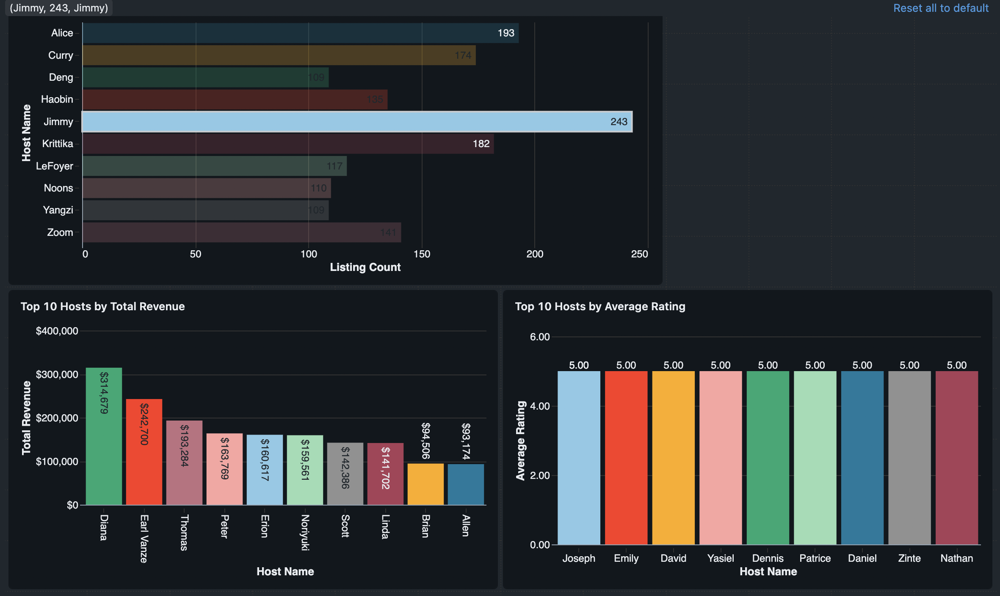
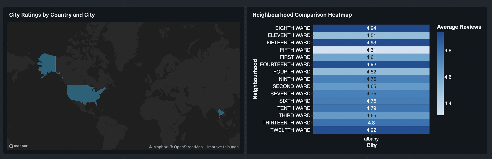
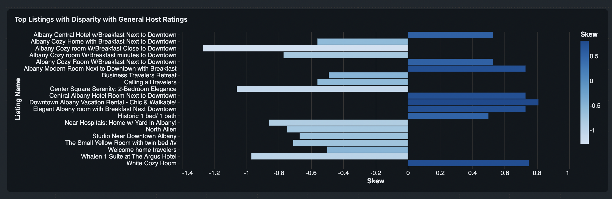
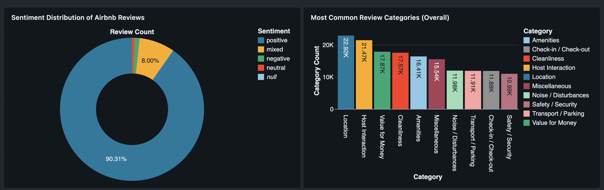
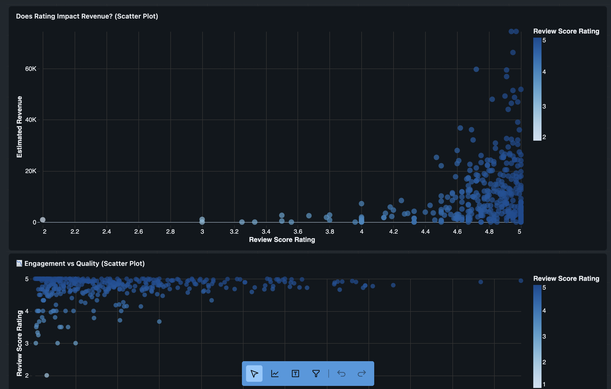

# 🚀 Databricks End-to-End Data Engineering Pipeline

An end-to-end modern Data Engineering project built on Databricks implementing a scalable **Medallion Architecture (Bronze → Silver → Gold)** with Delta Lake, automated transformations, and KPI-driven analytics.

---

# 🏗️ Architecture Overview

Bronze → Silver → Gold → BI Layer

---

# 📊 Dashboard & Visualization Layer

Below are the business intelligence dashboards built on top of the **Gold Layer KPI tables**.

---

## 🖥️ 1️⃣ Host Dashboard

**Purpose:** Track host-level performance metrics and identify top performers.

**KPIs & Visualizations:**

- **Top Hosts by Listing Count**  
  - **Table:** `airbnb_host_listing_counts_gold`  
  - **Query:** 
    ```sql
    SELECT name, listing_count
    FROM airbnb_host_listing_counts_gold
    ORDER BY listing_count DESC
    LIMIT 10
    ```
  - **Chart:** Horizontal Bar Chart  
  - **Why:** Long host names fit well horizontally and ranking is clear.

- **Top Hosts by Revenue**  
  - **Table:** `airbnb_hosts_revenue_gold`  
  - **Query:** 
    ```sql
    SELECT name, CAST(REPLACE(total_revenue, '$', '') AS DOUBLE) AS revenue
    FROM airbnb_hosts_revenue_gold
    ORDER BY revenue DESC
    LIMIT 10
    ```
  - **Chart:** Vertical Bar Chart  
  - **Why:** Vertical bars are executive-friendly and align with financial metrics.

- **Hosts by Average Rating**  
  - **Table:** `airbnb_hosts_reviews_gold`  
  - **Query:** 
    ```sql
    SELECT name, average_rating
    FROM airbnb_hosts_reviews_gold
    ORDER BY average_rating DESC
    LIMIT 10
    ```
  - **Chart:** Bar Chart  

**Insight:** Quickly identify top-performing hosts by listing count, revenue, and guest satisfaction.

### 📷 Dashboard Preview:


---


## 🌍 2️⃣ Geographical Dashboard

**Purpose:** Analyze performance across cities, countries, and neighbourhoods.

**KPIs & Visualizations:**

- **Average Rating per City**  
  - **Table:** `airbnb_city_ratings_gold`  
  - **Query:** 
    ```sql
    SELECT country, city, average_rating
    FROM airbnb_city_ratings_gold
    WHERE average_rating IS NOT NULL
    ORDER BY average_rating DESC
    ```
  - **Chart Options:**  
    - Map Chart (best if supported)  
    - Alternative: Bar Chart grouped by country  

- **Neighbourhood Performance**  
  - **Table:** `airbnb_neighbourhood_ratings_gold`  
  - **Query:** 
    ```sql
    SELECT country, city, neighbourhood, avg_reviews
    FROM airbnb_neighbourhood_ratings_gold
    WHERE avg_reviews IS NOT NULL
    ORDER BY avg_reviews DESC
    LIMIT 20
    ```
  - **Chart:** Heatmap  
    - X-axis = neighbourhood  
    - Y-axis = city  
    - Color intensity = avg_reviews  

**Insight:** Identify top-performing cities and neighbourhoods visually, with heatmaps highlighting intensity comparisons.


### 📷 Dashboard Preview:


---

## 📈 3️⃣ Performance Intelligence Dashboard

**Purpose:** Highlight operational performance and identify high/low-performing listings.

**KPIs & Visualizations:**

- **Listing Skew vs Host Average**  
  - **Table:** `airbnb_listing_skew_gold`  
  - **Query:** 
    ```sql
    SELECT host_name, listing_name, listing_review, user_reviews_avg, skew
    FROM airbnb_listing_skew_gold
    WHERE skew IS NOT NULL
    ORDER BY ABS(skew) DESC
    LIMIT 20
    ```
  - **Chart:** Diverging Bar Chart  
    - X-axis = skew  
    - Y-axis = listing_name  
    - Positive = outperforming, Negative = underperforming  

**Insight:** Spot listings performing above or below host averages to identify opportunities or risks.

### 📷 Dashboard Preview:


---

## 🤖 4️⃣ AI Intelligence Dashboard

**Purpose:** Visualize AI-driven insights from review text.

**KPIs & Visualizations:**

- **Sentiment Distribution**  
  - **Table:** `airbnb_reviews_gold`  
  - **Query:** 
    ```sql
    SELECT sentiment, COUNT(*) AS review_count
    FROM airbnb_reviews_gold
    GROUP BY sentiment
    ORDER BY review_count DESC
    ```
  - **Chart:** Pie Chart / Donut Chart  

- **Most Common Review Categories**  
  - **Query:** 
    ```sql
    SELECT category, COUNT(*) AS category_count
    FROM (
        SELECT explode(review_categories) AS category
        FROM airbnb_reviews_gold
    )
    GROUP BY category
    ORDER BY category_count DESC
    ```
  - **Chart:** Horizontal Bar Chart  

- **Top 5 Categories per Listing**  
  - **Table:** `airbnb_listing_top_categories_gold`  
  - **Query:** 
    ```sql
    SELECT listing_name, top_5_categories
    FROM airbnb_listing_top_categories_gold
    LIMIT 20
    ```
  - **Chart:** Table Visualization  

**Insight:** Understand guest sentiment and focus areas for operational improvements.

### 📷 Dashboard Preview:


---

## 🧠 5️⃣ Advanced / Business Dashboard

**Purpose:** Combine operational, revenue, and engagement metrics for executive-level decisions.

**KPIs & Visualizations:**

- **Revenue vs Rating Correlation**  
  - **Table:** `airbnb_listings_silver`  
  - **Query:** 
    ```sql
    SELECT l.id, l.review_scores_rating, l.estimated_revenue
    FROM airbnb_listings_silver l
    WHERE review_scores_rating IS NOT NULL
      AND estimated_revenue IS NOT NULL
    ```
  - **Chart:** Scatter Plot  
    - X-axis = review_scores_rating  
    - Y-axis = estimated_revenue  

- **Reviews per Month vs Rating**  
  - **Table:** `airbnb_listings_silver`  
  - **Query:** 
    ```sql
    SELECT reviews_per_month, review_scores_rating
    FROM airbnb_listings_silver
    WHERE reviews_per_month IS NOT NULL
      AND review_scores_rating IS NOT NULL
    ```
  - **Chart:** Scatter Plot  

**Insight:** Executive-level visualization to guide strategic decisions, showing relationships between guest engagement, satisfaction, and revenue.

### 📷 Dashboard Preview:


---

# ⚡ Optimization Techniques

- Delta Lake Optimize & Vacuum
- Z-Ordering
- Partitioning Strategy
- Incremental MERGE Operations
- Cluster Performance Tuning
